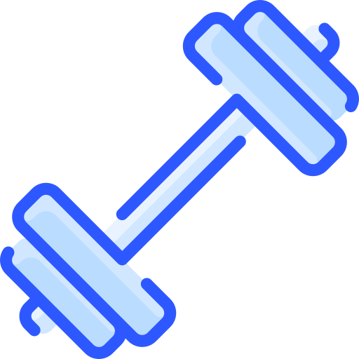

#  Workout Generator App
Welcome to the **Workout Generator App**! This application allows users to generate personalized workouts based on their fitness goals and preferences.
The App is deployed with netlify and you can launch it by clicking [here](https://gym-app-imruki.netlify.app/)

## Features

- **Personalized Workouts**: Select your workout type, target muscles, and fitness goals to receive a tailored workout plan.
- **User-Friendly Interface**: Built with ReactJS for a smooth and interactive user experience.
- **Modern Design**: Using Tailwind CSS for responsive and modern styling.

## Getting Started

To get started with the Workout Generator App, follow these steps:

1. **Clone the Repository**:
   ```bash
   git clone https://github.com/imruki/Workout-Generator-App.git
   cd Workout-Generator-App

2. **Install Dependencies**:
   ```bash
   npm install

2. **Run the Application**:
   ```bash
   npm run dev

## How to Use

- Select your workout type, target muscles, and fitness goal from the provided options.
- Click the "Generate Workout" button to receive your customized workout plan.

## Contributing

Contributions are welcome! If you have suggestions for improvements or new features, feel free to open an issue or submit a pull request.
License

This project is licensed under the MIT License. See the [LICENSE](https://github.com/imruki/Workout-Generator-App/blob/main/LICENSE) file for more details.
Big thanks to [jamezmca](https://github.com/jamezmca) for providing the workout schemes and the workout generator algorithm!
